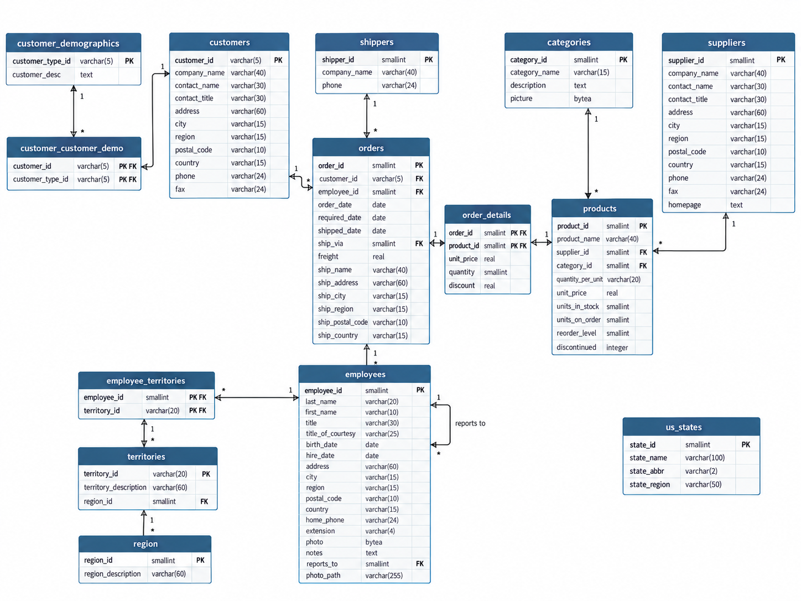

# Práctica 02 — Ejercicios modelo SQL con Northwind

## Autor

Jesús Martínez de la Casa

Resolvemos 20 ejercicios de SQL con Northwind. Incluimos las consultas, una explicación breve y las capturas de los resultados.

## Entorno

| Herramienta | Versión utilizada |
| --- | --- |
| PostgreSQL | 18 |
| pgAdmin | 4 |

## Cómo preparar la base de datos

Necesitamos PostgreSQL, pgAdmin y el archivo `northwind.sql` que nos ha dado el profesor.

Para preparar la base y ejecutar las consultas seguimos estos pasos:

1. En pgAdmin creamos una base nueva llamada `northwind`, con codificación `UTF8` y plantilla `template0`, desde **Databases → Create → Database**. Si ya existe una base con ese nombre, comprobamos su contenido antes de continuar.
2. Seleccionamos `northwind` y abrimos **Query Tool**. Comprobamos que la conexión apunta a esa base.
3. Abrimos el archivo `northwind.sql` y ejecutamos el script completo. El archivo borra las tablas y vuelve a crearlas. Si lo cargamos de nuevo se sustituyen los datos que ya hay.
4. Comprobamos las 14 tablas, el número de registros, las restricciones y los caracteres como explicamos en la [documentación de preparación](preparacion/README.md).
5. Abrimos el Query Tool conectado a `northwind` y ejecutamos por separado los bloques de [respuestas.md](respuestas.md).

Comprobamos que hay 91 clientes, 830 pedidos, 2155 líneas de pedido, 77 productos, 9 empleados y 29 proveedores. También hay 14 claves primarias, 13 claves ajenas y 31 restricciones NOT NULL.

## Esquema de apoyo

Esquema de apoyo hecho con ayuda de IA. En `order_details` el tipo de `quantity` es `smallint`, aunque en la imagen aparece como `real`.

## Índice

- [Preparación de Northwind: carga y comprobaciones](preparacion/README.md).
- [Respuestas de los 20 ejercicios](respuestas.md).
