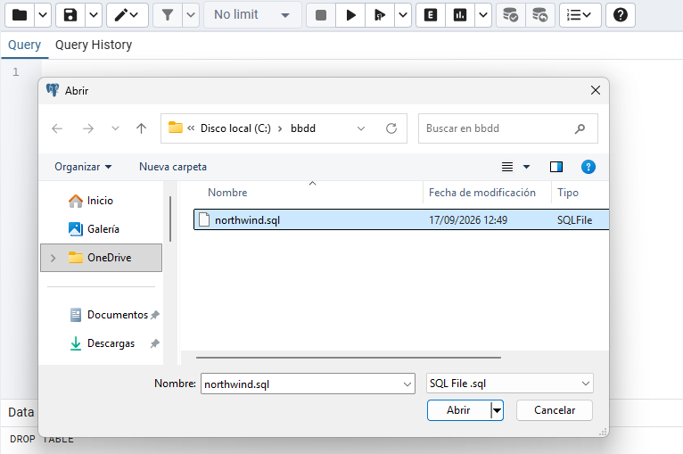
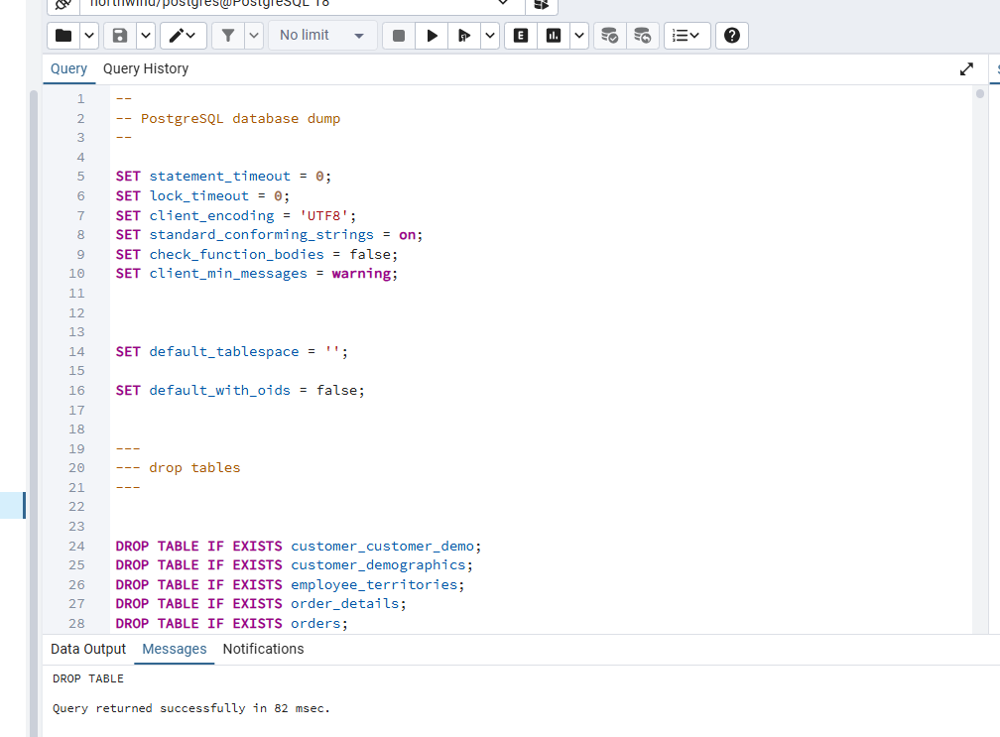
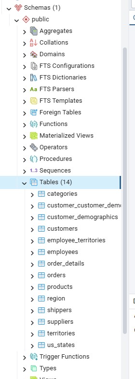
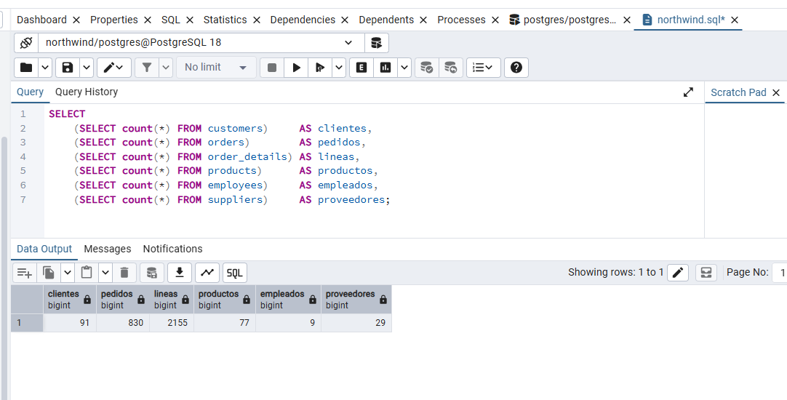
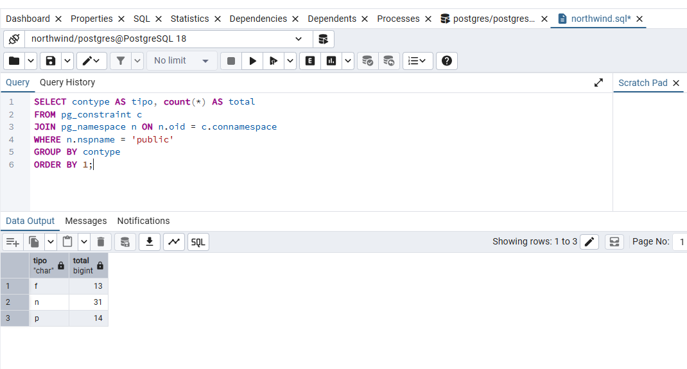
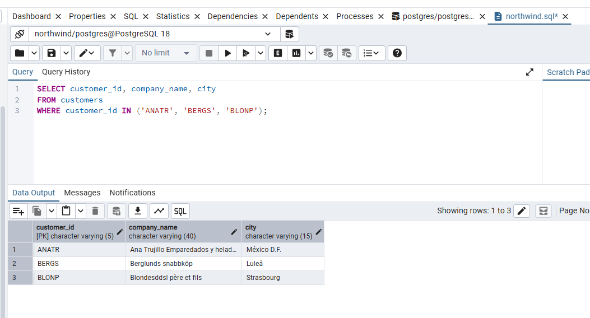
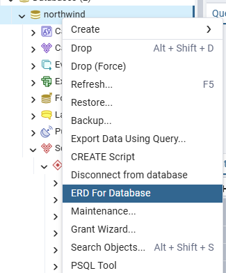
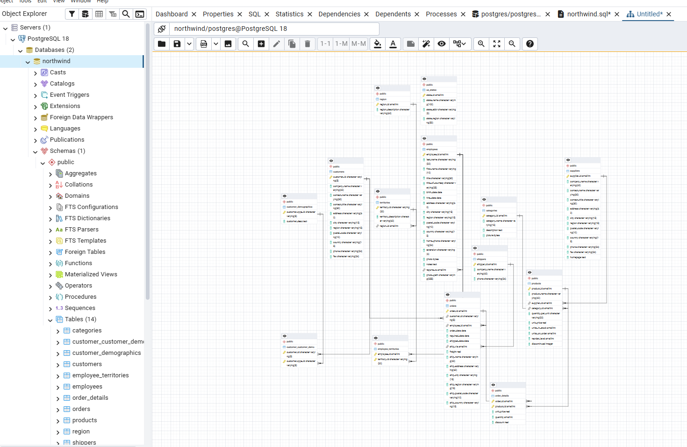

# Preparación de Northwind en PostgreSQL

Cargamos Northwind en pgAdmin y comprobamos las tablas y los datos antes de empezar los ejercicios.

## 1. Abrimos el script

En el Query Tool de pgAdmin abrimos `northwind.sql` desde `C:\bbdd`.

Comprobamos que la conexión apunta a `northwind` con el usuario `postgres` y cargamos el script. El archivo borra las tablas y vuelve a crearlas antes de añadir los datos.

## 2. Comprobamos las tablas

Desplegamos `Schemas → public → Tables` y vemos las 14 tablas de Northwind.

## 3. Comprobamos los registros cargados

Con `count(*)` contamos las filas de las seis tablas principales. Reunimos los resultados en una sola fila para compararlos con los valores del enunciado.

| Tabla | Registros |
| --- | --- |
| `customers` | 91 |
| `orders` | 830 |
| `order_details` | 2155 |
| `products` | 77 |
| `employees` | 9 |
| `suppliers` | 29 |

El número de registros de las seis tablas coincide con lo que indica el enunciado.

## 4. Revisamos las restricciones

Consultamos `pg_constraint`, lo relacionamos con `pg_namespace` y filtramos el esquema `public`. Agrupamos por tipo para contar las restricciones.

| Código | Significado | Resultado |
| --- | --- | --- |
| `f` | Clave ajena. Relaciona tablas | 13 |
| `n` | NOT NULL. Impide valores nulos | 31 |
| `p` | Clave primaria. Identifica cada fila | 14 |

## 5. Revisamos los caracteres

Seleccionamos los clientes `ANATR`, `BERGS` y `BLONP`. Comprobamos que textos como `México D.F.`, `Berglunds snabbköp` y `Luleå` se muestran correctamente.

## 6. Abrimos el diagrama de la base

En el menú contextual de `northwind` seleccionamos `ERD For Database` para ver las tablas y sus relaciones.

En la pestaña ERD vemos las conexiones entre las tablas de la base.

[Volver a la práctica](../README.md).
