# Respuestas — Práctica 02 SQL

## Pregunta 1. Catálogo comercial activo

**Enunciado:**

Selecciona productos activos con un precio de 10 a 50 euros incluidos. Devuelve su nombre como producto y su precio con dos decimales como precio. Coloca primero los más caros.

**Consulta:**

```sql
--Productos activos con precio entre 10 y 50 euros
SELECT product_name as producto, ROUND(unit_price::numeric,2) as precio
FROM products
WHERE discontinued=0 AND unit_price BETWEEN 10 and 50
ORDER BY precio DESC
```

**Resultado:**

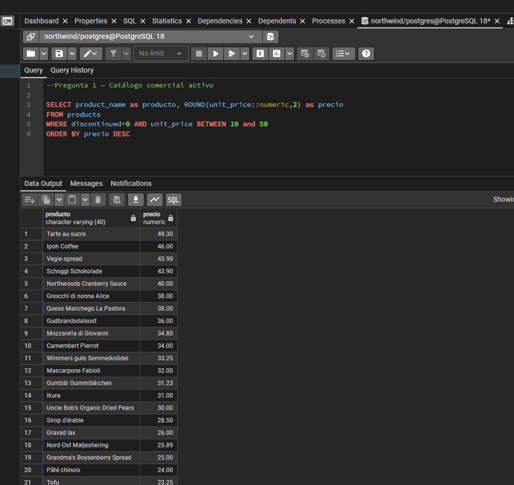

**Comentario:**

Usamos BETWEEN porque incluye los dos límites del precio. Convertimos el precio a numeric para poder redondearlo a dos decimales con ROUND.

## Pregunta 2. Concentración geográfica de la cartera

**Enunciado:**

Agrupa los clientes por país y conserva los países que llegan a cinco clientes. Incluye el número de clientes y de ciudades diferentes. Ordena por el número de clientes de mayor a menor.

**Consulta:**

```sql
-- Países con al menos 5 clientes y su número de ciudades distintas
SELECT country AS pais, COUNT(*) as num_clientes, COUNT(DISTINCT city) AS num_ciudades
FROM customers
GROUP BY country
HAVING count(*) >= 5
ORDER BY num_clientes DESC;
```

**Resultado:**

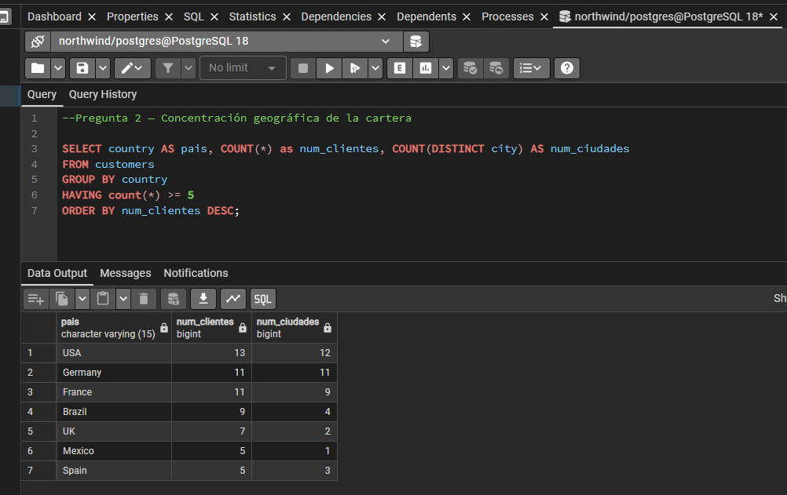

**Comentario:**

Usamos HAVING porque filtramos el número de clientes después de agrupar por país. Con COUNT(DISTINCT city) evitamos contar varias veces la misma ciudad.

## Pregunta 3. Alerta de reposición

**Enunciado:**

Busca productos activos con stock igual o menor que su nivel de reposición. Incluye producto, stock, nivel de reposición y unidades pedidas al proveedor. Añade CRÍTICO si el stock es cero y AVISO en los demás casos.

**Consulta:**

```sql
-- Productos activos con stock igual o inferior al nivel de reposición
SELECT product_name AS producto, units_in_stock as stock, reorder_level as nivel_reposicion, 
		units_on_order AS pedido_a_proveedor,
		CASE WHEN units_in_stock=0 THEN 'CRÍTICO'
		ELSE 'AVISO'
		END AS situacion
FROM products
WHERE discontinued=0 and units_in_stock <= reorder_level
```

**Resultado:**

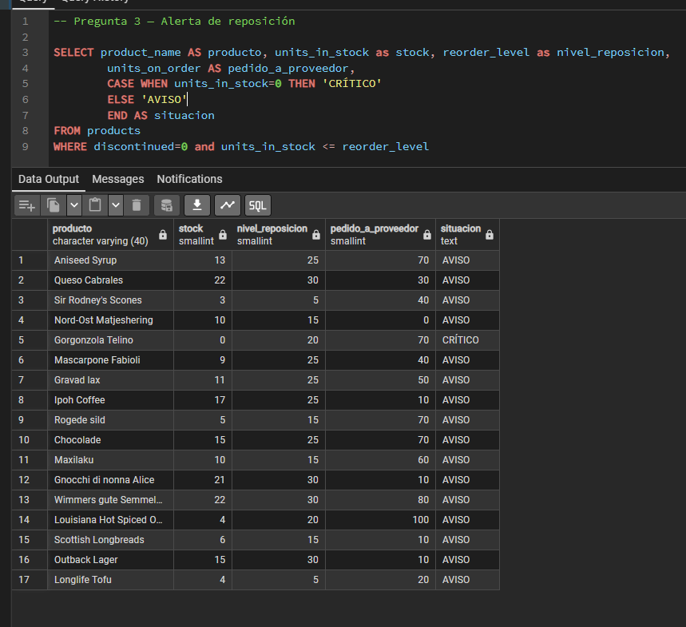

**Comentario:**

Comparamos las dos columnas para usar el nivel de reposición de cada producto. Con CASE asignamos la situación según el stock. Ambas columnas admiten NULL y si falta uno de esos datos la comparación deja fuera el producto.

## Pregunta 4. Ficha completa de producto

**Enunciado:**

Relaciona cada producto con su categoría y proveedor. Selecciona proveedores de Italia, Francia y España y muestra también su país y ciudad. Ordena primero por país y después por producto.

**Consulta:**

```sql
-- Productos de proveedores de Italia, Francia o España con su categoría
SELECT p.product_name AS producto, c.category_name as categoria, s.company_name AS proveedor,
		s.country as pais, s.city as ciudad
FROM products p
INNER JOIN categories c 
USING (category_id)
INNER JOIN suppliers s
USING (supplier_id)
WHERE s.country in ('Italy','France','Spain')
ORDER BY s.country, p.product_name
```

**Resultado:**

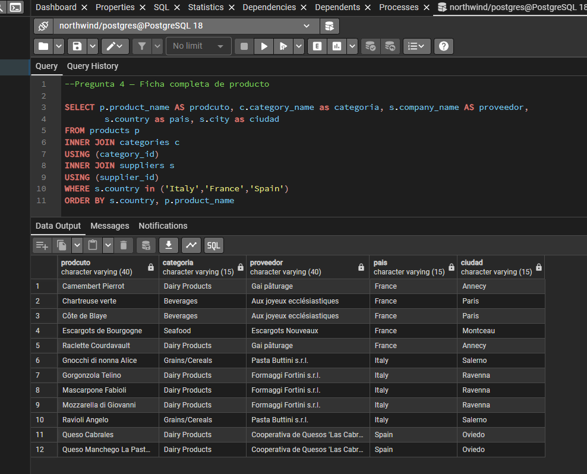

**Comentario:**

Unimos products con categories y suppliers mediante sus claves. Filtramos el país del proveedor con IN usando los nombres en inglés que aparecen en los datos.

## Pregunta 5. Detalle valorizado de un pedido

**Enunciado:**

Desglosa el pedido 10248 por productos con el precio aplicado, cantidad, descuento e importe de línea. Incluye también el cliente y la fecha del pedido.

**Consulta:**

```sql
-- Líneas del pedido 10248 con su importe después del descuento
SELECT c.company_name as cliente, o.order_date as fecha_pedido, p.product_name as producto,
		ROUND(od.unit_price::numeric,2) as precio_unitario, od.quantity as cantidad,
		od.discount::numeric as descuento, 
		ROUND(od.unit_price::numeric * od.quantity * (1-od.discount::numeric),2) as importe_linea
FROM orders o
INNER JOIN customers c 
USING(customer_id)
INNER JOIN order_details od 
USING (order_id)
INNER JOIN products p 
USING(product_id)
WHERE o.order_id=10248;
```

**Resultado:**

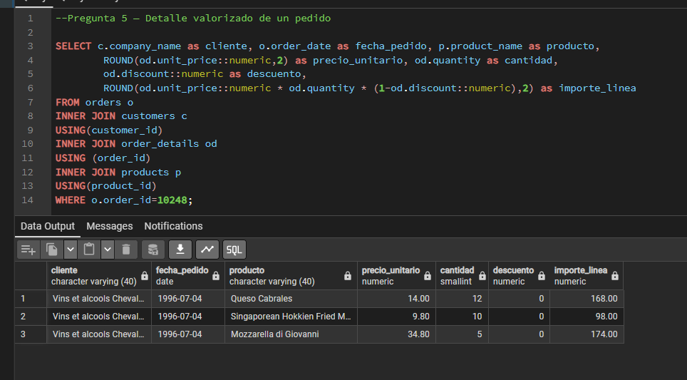

**Comentario:**

Usamos el precio de order_details porque es el aplicado al pedido y puede ser distinto del precio actual. USING une las claves con el mismo nombre y calculamos cada importe con el descuento antes de redondearlo.

## Pregunta 6. Ranking de categorías por facturación

**Enunciado:**

Resume las ventas históricas por categoría con su número de líneas, productos diferentes y facturación. Conserva las categorías con más de 100.000 euros y ordénalas de mayor a menor facturación.

**Consulta:**

```sql
-- Categorías que superan 100000 euros de facturación
SELECT c.category_name AS categoria, count(*) as num_lineas,
		count(DISTINCT p.product_id) as num_productos,
		SUM(ROUND(od.unit_price::numeric * od.quantity * (1-od.discount::numeric),2 )) as facturacion
FROM categories c
INNER JOIN products p
USING(category_id)
INNER JOIN order_details od
USING(product_id)
GROUP BY c.category_id, c.category_name
HAVING SUM(ROUND(od.unit_price::numeric * od.quantity * (1-od.discount::numeric),2)) > 100000
ORDER BY facturacion DESC
```

**Resultado:**

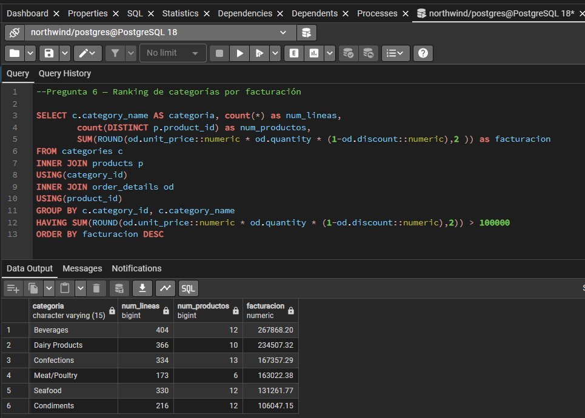

**Comentario:**

Sumamos los importes redondeados por línea siguiendo la fórmula del enunciado. COUNT(DISTINCT p.product_id) evita contar un producto varias veces y HAVING filtra la facturación de cada categoría.

## Pregunta 7. Clientes sin actividad comercial

**Enunciado:**

Lista todos los clientes con su número de pedidos y la fecha del último. Los clientes sin pedidos deben aparecer con un 0 y el texto 'SIN PEDIDOS' en lugar de la fecha. Ordena con los clientes inactivos primero.

**Consulta:**

```sql
-- Clientes con su número de pedidos y la fecha del último
SELECT c.company_name as cliente, c.country as pais, count(o.order_id) as num_pedidos,
		COALESCE(MAX(o.order_date)::text,'SIN PEDIDOS') AS ultimo_pedido
FROM customers c
LEFT JOIN orders o
on o.customer_id=c.customer_id
GROUP BY c.customer_id, c.company_name, c.country
ORDER BY num_pedidos, cliente
```

**Resultado:**

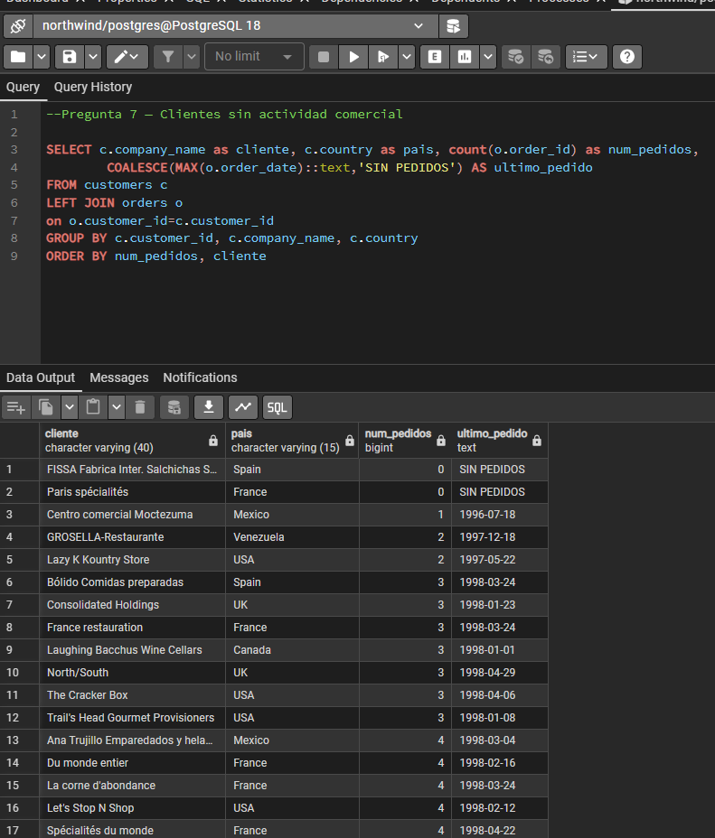

**Comentario:**

LEFT JOIN conserva los clientes sin pedidos y COUNT(o.order_id) devuelve 0 porque no cuenta los nulos. Convertimos la última fecha a texto para poder mostrar SIN PEDIDOS con COALESCE.

## Pregunta 8. Organigrama de la fuerza de ventas

**Enunciado:**

Muestra cada empleado con su nombre completo, cargo, nombre completo de su responsable y cargo de esa persona. Incluye al empleado sin responsable con el texto 'DIRECCIÓN GENERAL' en el campo del responsable.

**Consulta:**

```sql
-- Empleados con su responsable directo, incluidos los que no tienen superior
SELECT emp.first_name || ' ' || emp.last_name as empleado, emp.title as cargo,
		COALESCE(jefe.first_name || ' ' || jefe.last_name, 'DIRECCIÓN GENERAL') as responsable,
		jefe.title as cargo_responsable
FROM employees emp
LEFT JOIN employees jefe
on jefe.employee_id=emp.reports_to
```

**Resultado:**

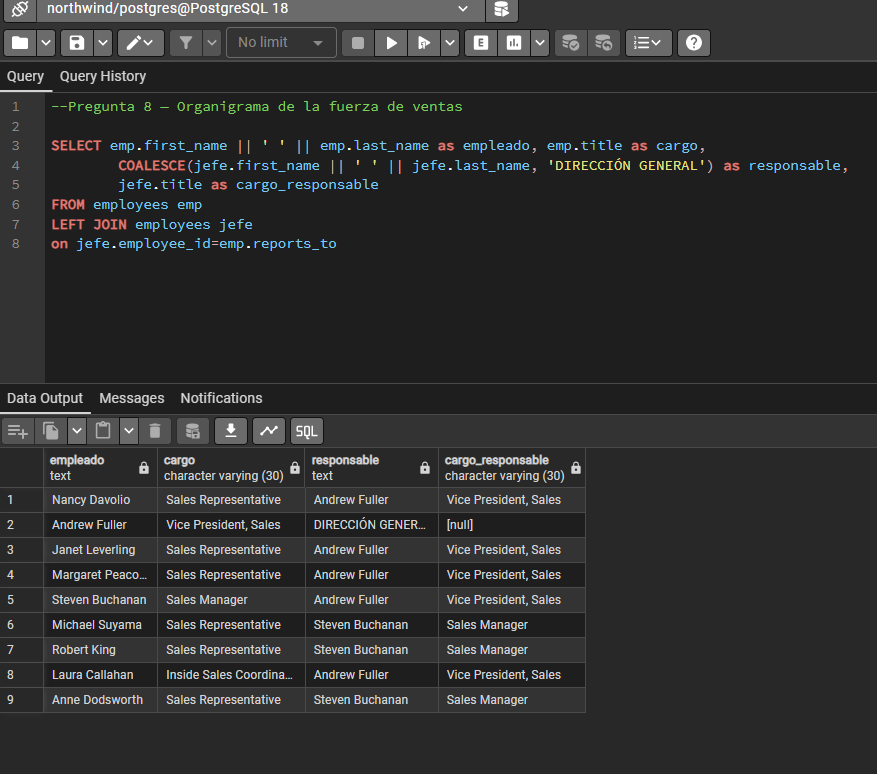

**Comentario:**

Usamos employees dos veces con alias distintos para relacionar cada empleado con su superior. LEFT JOIN conserva al empleado sin jefe y dejamos su cargo_responsable en NULL porque no existe ese responsable.

## Pregunta 9. Rejilla de cobertura categoría × año

**Enunciado:**

Genera las 24 combinaciones de las 8 categorías con los años 1996, 1997 y 1998. Asocia su facturación y muestra 0 donde no haya ventas. Ordena por categoría y año.

**Consulta:**

```sql
-- Rejilla completa de categorías y años con su facturación
SELECT c.category_name as categoria, a.anio as anio, COALESCE(v.facturacion,0::numeric) AS facturacion
FROM categories c
CROSS JOIN (VALUES (1996), (1997), (1998)) as a(anio)
LEFT JOIN (
	SELECT p.category_id, EXTRACT(YEAR FROM o.order_date)::integer as anio,
			sum(ROUND(od.unit_price::numeric*od.quantity*(1-od.discount::numeric),2)) as facturacion
	FROM products p
	INNER JOIN order_details od
	on od.product_id=p.product_id
	INNER JOIN orders o
	on o.order_id=od.order_id
	GROUP BY p.category_id, EXTRACT(YEAR FROM o.order_date)::integer
) v on v.category_id=c.category_id and v.anio=a.anio
ORDER BY categoria, anio
```

**Resultado:**

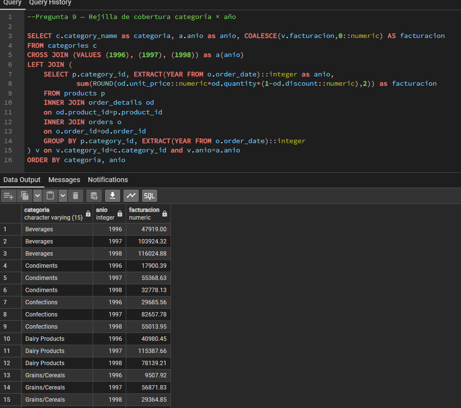

**Comentario:**

CROSS JOIN crea todas las combinaciones antes de unir las ventas con LEFT JOIN. Así conservamos los años sin ventas y COALESCE muestra 0 en su facturación.

## Pregunta 10. Mapa de países: clientes frente a proveedores

**Enunciado:**

Muestra todos los países con presencia de clientes o proveedores y el número de cada uno. Indica 'SOLO CLIENTES', 'SOLO PROVEEDORES' o 'AMBOS' según corresponda.

**Consulta:**

```sql
-- Países con sus clientes, proveedores y tipo de presencia
SELECT COALESCE(c.country, s.country) as pais, COALESCE(c.num_clientes,0) as num_clientes, COALESCE(s.num_proveedores,0) as num_proveedores,		
		CASE WHEN c.num_clientes IS NULL THEN 'SOLO PROVEEDORES'
		WHEN s.num_proveedores IS NULL THEN 'SOLO CLIENTES'
		ELSE 'AMBOS'
		END AS tipo_presencia
FROM(
	SELECT country, COUNT(*) as num_clientes
	FROM customers
	GROUP BY country
) c
FULL JOIN(
	SELECT country, count(*) as num_proveedores
	FROM suppliers
	GROUP BY country
) s ON s.country=c.country
```

**Resultado:**

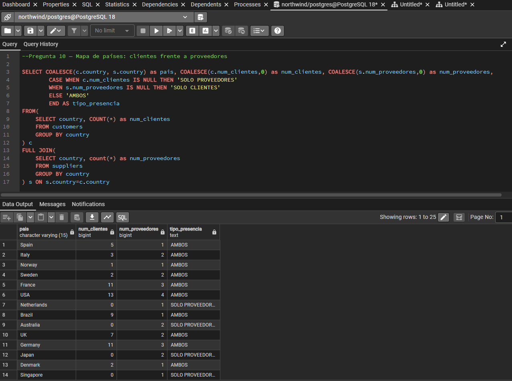

**Comentario:**

Contamos cada tabla antes de unirlas para no multiplicar clientes por proveedores. FULL JOIN incluye los países de las dos tablas. COALESCE toma el nombre del país y muestra 0 si no hay clientes o proveedores.

## Pregunta 11. Directorio unificado de contactos

**Enunciado:**

Reúne contactos de clientes, proveedores y empleados. Muestra origen, contacto en mayúsculas, organización, ciudad y país. Para empleados usa 'NORTHWIND TRADERS' como organización y concatena nombre y apellidos. Ordena por origen y país.

**Consulta:**

```sql
-- Directorio conjunto de clientes, proveedores y empleados
SELECT 'CLIENTE' as origen, UPPER(contact_name) as contacto, company_name as organizacion, city as ciudad, country as pais		 
FROM customers
UNION ALL
SELECT 'PROVEEDOR' as origen, UPPER(contact_name) as contacto, company_name as organizacion, city as ciudad, country as pais	
FROM suppliers
UNION ALL
SELECT 'EMPLEADO' as origen, UPPER(first_name || ' ' || last_name) as contacto,
		'NORTHWIND TRADERS' as organizacion, city as ciudad, country as pais
FROM employees
ORDER BY origen, pais
```

**Resultado:**

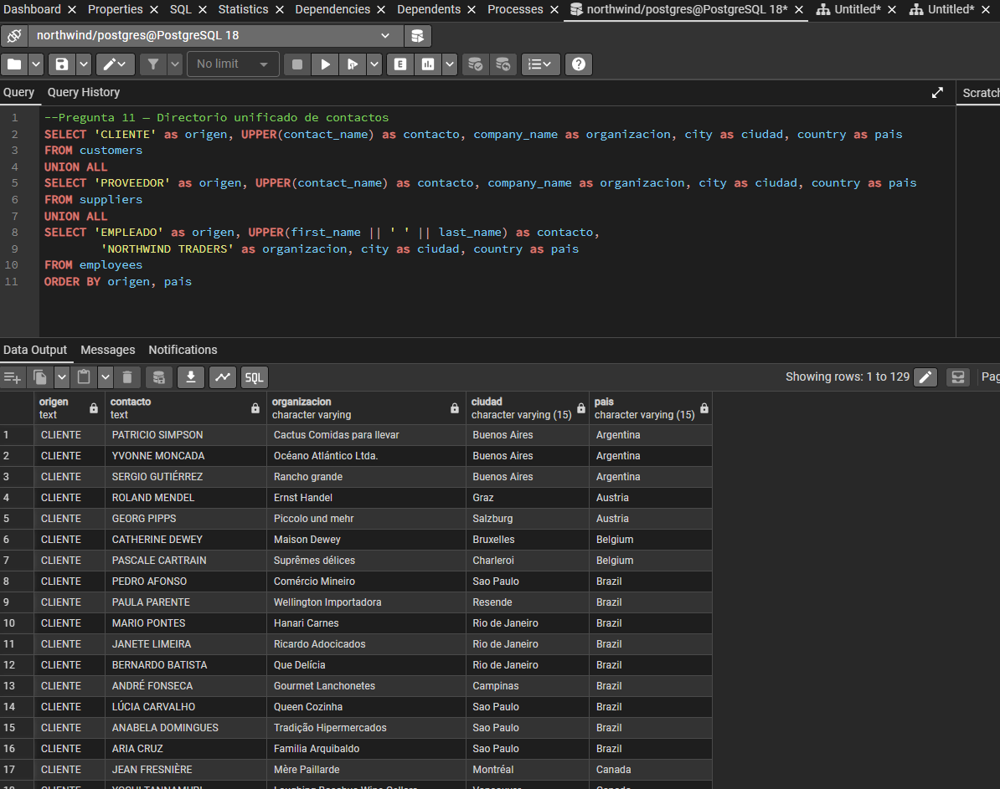

**Comentario:**

UNION ALL junta los registros sin quitar los repetidos. La columna origen indica si cada contacto es un cliente, un proveedor o un empleado.

## Pregunta 12. Mercados con desequilibrio

**Enunciado:**

Resuelve en dos consultas independientes los países con clientes pero sin proveedores y los países con ambos. Ordena los dos resultados alfabéticamente.

**Consulta a:**

```sql
-- Países con clientes pero sin proveedores
SELECT country as pais
FROM customers
EXCEPT
SELECT country as pais
FROM suppliers
ORDER BY pais;
```

**Consulta b:**

```sql
-- Países con clientes y proveedores
SELECT country as pais
FROM customers
INTERSECT
SELECT country as pais
FROM suppliers
ORDER BY pais;
```

**Resultado:**

**Apartado a:**

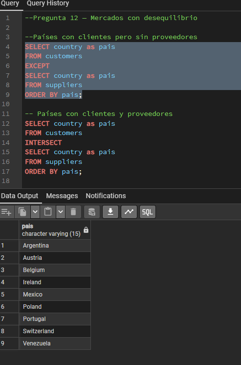

**Apartado b:**

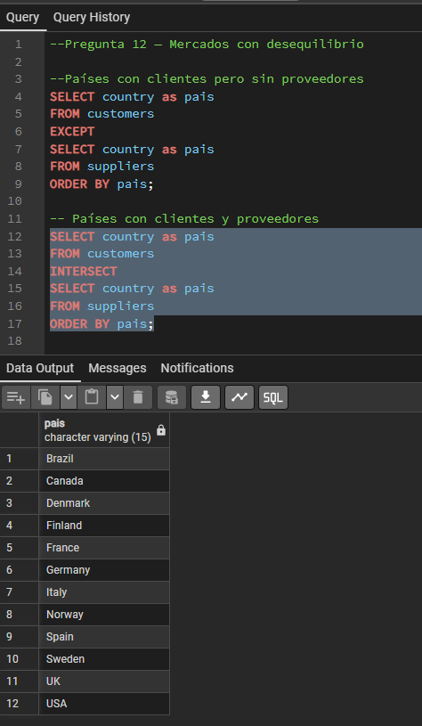

**Comentario:**

EXCEPT obtiene los países que solo están en clientes e INTERSECT los que aparecen en las dos tablas. Los dos operadores eliminan duplicados para que cada país aparezca una sola vez.

## Pregunta 13. Clientes que nunca han comprado pescado

**Enunciado:**

Localiza los clientes que nunca han comprado productos de la categoría 'Seafood'. Muestra cliente, país y número total de pedidos de mayor a menor. Usa NOT EXISTS y prueba también NOT IN teniendo en cuenta los nulos.

**Consulta:**

```sql
-- Clientes sin compras de Seafood con su número total de pedidos
SELECT c.company_name AS cliente, c.country as pais,COUNT(o.order_id) as pedidos_realizados
FROM customers c
LEFT JOIN orders o
USING(customer_id)
WHERE NOT EXISTS (
	SELECT 1
	FROM orders os
	INNER JOIN order_details od USING(order_id)
	INNER JOIN products p USING( product_id)
	INNER JOIN categories cat USING(category_id)
	WHERE os.customer_id = c.customer_id AND cat.category_name = 'Seafood'
)
GROUP BY c.customer_id, c.company_name,c.country
ORDER BY pedidos_realizados DESC, cliente;
```

**Alternativa con NOT IN:**

```sql
-- Misma selección con NOT IN evitando nulos en la subconsulta
SELECT c.company_name as cliente, c.country AS pais, count(o.order_id) as pedidos_realizados
FROM customers c
LEFT JOIN orders o USING(customer_id)
WHERE c.customer_id NOT IN (
	SELECT os.customer_id
	FROM orders os
	INNER JOIN order_details od USING(order_id)
	INNER JOIN products p USING(product_id)
	INNER JOIN categories cat USING(category_id)
	WHERE cat.category_name='Seafood' and os.customer_id IS NOT NULL
)
GROUP BY c.customer_id, c.company_name, c.country
ORDER BY pedidos_realizados DESC, cliente;
```

**Resultado:**

**NOT EXISTS:**

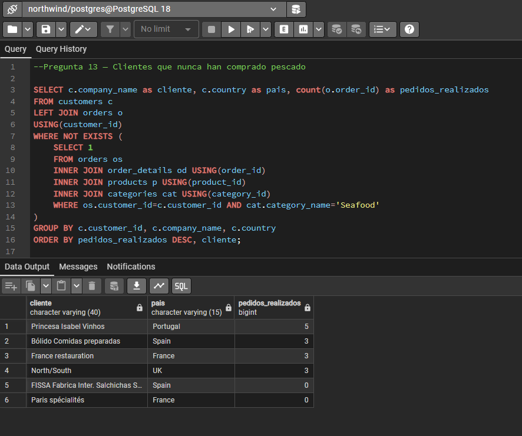

**NOT IN:**

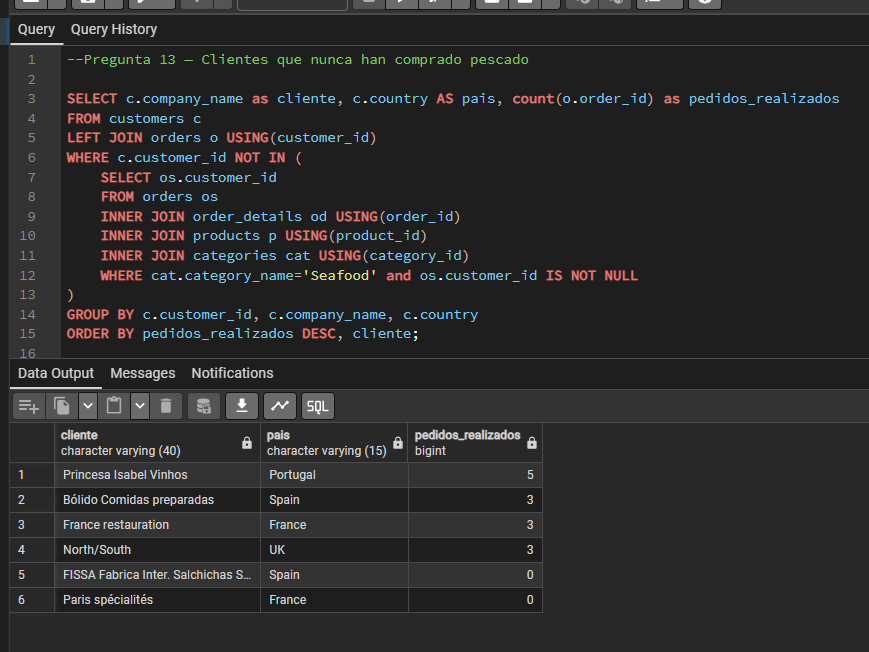

Las dos consultas devuelven los mismos seis clientes y el mismo número de pedidos.

**Comentario:**

NOT EXISTS descarta al cliente si encuentra alguna compra de Seafood y LEFT JOIN conserva también al que nunca ha pedido. En NOT IN excluimos los customer_id nulos porque un NULL en la subconsulta puede dejar el resultado vacío.

## Pregunta 14. Productos por encima de la media

**Enunciado:**

Muestra los productos activos cuyo precio supere la media de todo el catálogo. Incluye producto, precio, media general y diferencia con dos decimales. Ordena por diferencia descendente.

**Consulta:**

```sql
-- Productos activos con precio superior a la media de todo el catálogo
SELECT p.product_name AS producto, ROUND(p.unit_price::numeric,2) AS precio,
			ROUND((
				SELECT AVG(p2.unit_price::numeric)
				FROM products p2
			),2) as precio_medio_catalogo,
			ROUND(p.unit_price::numeric - (
				SELECT AVG(p3.unit_price::numeric)
				FROM products p3
			),2 ) as diferencia
FROM products p
WHERE p.discontinued=0
	AND p.unit_price::numeric > (
	SELECT AVG( p4.unit_price::numeric)
	FROM products p4
	)
ORDER BY diferencia DESC
```

**Resultado:**

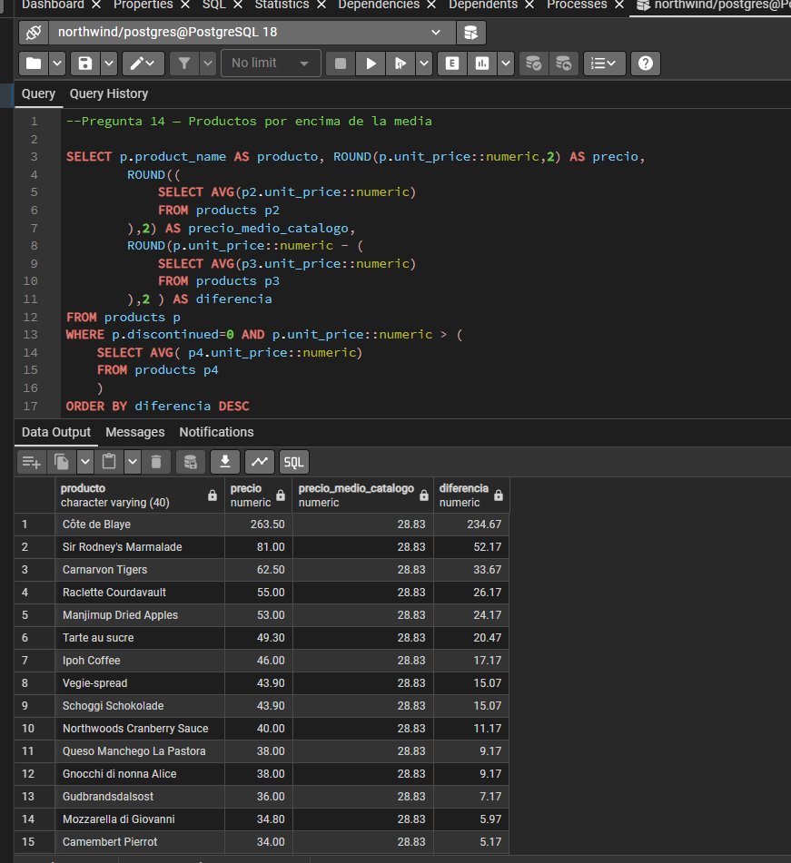

**Comentario:**

Calculamos la media sin filtrar los descatalogados porque se pide todo el catálogo. Filtramos los activos fuera de la subconsulta y redondeamos la diferencia después de restar.

## Pregunta 15. Ticket medio por cliente

**Enunciado:**

Para clientes con compras calcula número de pedidos, importe total e importe medio por pedido. Primero suma las líneas de cada pedido y después calcula la media por cliente. Muestra los 15 clientes con mayor ticket medio.

**Consulta:**

```sql
-- Los 15 clientes con mayor importe medio por pedido
SELECT c.company_name AS cliente,c.country AS pais, count (*) AS num_pedidos, SUM( ped.importe_pedido) as importe_total,
		 ROUND(AVG (ped.importe_pedido), 2) as ticket_medio
FROM customers c
INNER JOIN (
	SELECT o.order_id, o.customer_id,
			sum( ROUND(od.unit_price::numeric * od.quantity * (1-od.discount::numeric), 2)) as importe_pedido
	FROM orders o
	INNER JOIN order_details od USING(order_id)
	GROUP BY o.order_id,o.customer_id
) ped USING(customer_id)
GROUP BY c.customer_id, c.company_name, c.country
ORDER BY AVG(ped.importe_pedido) DESC, c.customer_id
LIMIT 15;
```

**Resultado:**

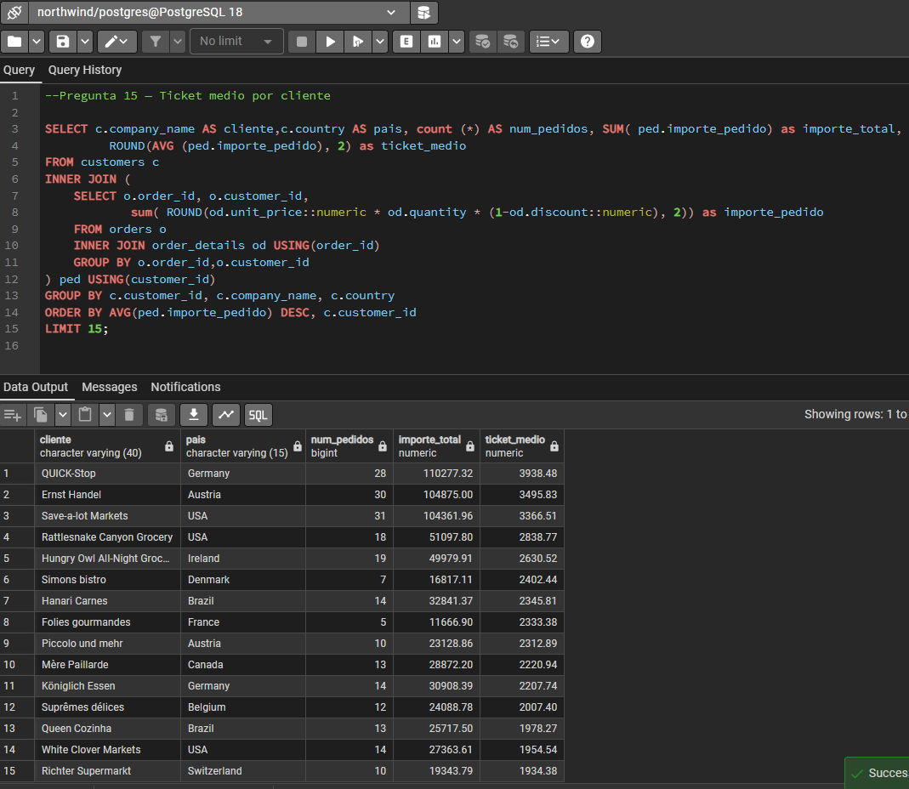

**Comentario:**

La subconsulta suma las líneas y devuelve una fila por pedido. Después calculamos la media por cliente para no confundir el ticket medio con el importe medio de una línea.

## Pregunta 16. El producto más caro de cada categoría

**Enunciado:**

Muestra por categoría el producto con mayor precio junto con su precio y la media de su categoría. Usa subconsultas correlacionadas para comparar con el máximo y obtener la media.

**Consulta:**

```sql
-- Productos con el precio máximo de su categoría, incluidos los empates
SELECT c.category_name as categoria, p.product_name AS producto, ROUND (p.unit_price::numeric, 2) AS precio,
			ROUND((
				SELECT AVG(p2.unit_price::numeric)
				FROM products p2
				WHERE p2.category_id = p.category_id
			), 2) as precio_medio_categoria
FROM products p
INNER JOIN categories c USING(category_id)
WHERE p.unit_price=(
	SELECT MAX(p3.unit_price)
	FROM products p3
	WHERE p3.category_id=p.category_id
)
```

**Resultado:**

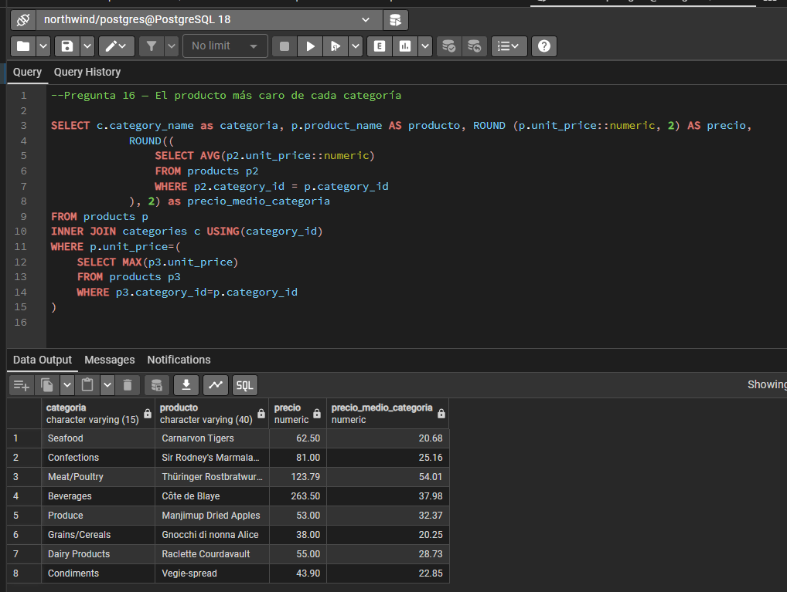

**Comentario:**

Las subconsultas usan la categoría del producto de la consulta principal para calcular el precio máximo y la media. Al comparar con MAX incluimos todos los productos que empatan en el precio más alto.

## Pregunta 17. Segmentación ABC de la cartera de clientes

**Enunciado:**

Calcula la facturación de cada cliente con CTE y divide los clientes en cuatro cuartiles. Asigna 'A - Estratégico', 'B - Consolidado', 'C - Ocasional' y 'D - Marginal' de mayor a menor facturación. Muestra por segmento el número de clientes, la facturación y el porcentaje sobre el total.

**Consulta:**

```sql
-- Segmentos A–D por cuartiles de facturación de toda la cartera
-- Consulta preparada con ayuda de IA.
-- Incluimos clientes sin pedidos con 0 y desempatamos por customer_id.
WITH facturacion_cliente as (
	SELECT c.customer_id,
			COALESCE(sum(ROUND(od.unit_price::numeric * od.quantity * (1-od.discount::numeric), 2)), 0::numeric ) as facturacion
	FROM customers c
	LEFT JOIN orders o 	USING(customer_id)
	LEFT JOIN order_details od USING(order_id)
	GROUP BY c.customer_id
), cuartiles as (
	SELECT customer_id, facturacion, NTILE(4) OVER (ORDER BY facturacion DESC,customer_id) AS cuartil
	FROM facturacion_cliente
), segmentos as (
	SELECT customer_id, facturacion,
			CASE cuartil
				WHEN 1 THEN 'A - Estratégico'
				WHEN 2 THEN 'B - Consolidado'
				WHEN 3 THEN 'C - Ocasional'
				ELSE 'D - Marginal'
			END as segmento
	FROM cuartiles
)
SELECT segmento, count(*) AS num_clientes, SUM( facturacion ) AS facturacion_segmento,
		ROUND( 100::numeric * SUM( facturacion) / NULLIF((
			SELECT SUM( facturacion)
			FROM facturacion_cliente
		), 0), 2) as porcentaje_sobre_total
FROM segmentos
GROUP BY segmento
ORDER BY segmento
```

**Resultado:**

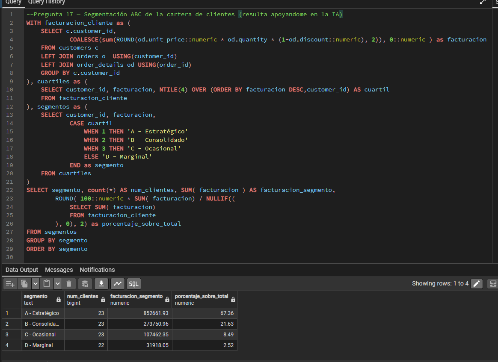

**Comentario:**

Incluimos a todos los clientes y asignamos 0 a los que no tienen pedidos. NTILE(4) reparte los clientes en cuatro grupos de tamaño parecido y puede separar clientes con igual facturación.

## Pregunta 18. Los tres productos más vendidos de cada categoría

**Enunciado:**

Obtén los tres productos con mayor facturación de cada categoría. Muestra categoría, posición en la categoría, producto, unidades vendidas, facturación y posición global en la compañía.

**Consulta:**

```sql
-- Tres productos por categoría según facturación con su posición global
WITH ventas_producto AS (
	SELECT c.category_id,c.category_name AS categoria, p.product_id,p.product_name as producto,
			SUM ( od.quantity) as unidades,
			SUM(ROUND(od.unit_price::numeric * od.quantity * (1-od.discount::numeric), 2 )) as facturacion
	FROM categories c
	INNER JOIN products p USING(category_id)
	INNER JOIN order_details od USING(product_id)
	GROUP BY c.category_id, c.category_name,p.product_id, p.product_name
),posiciones as (
	SELECT categoria,producto,unidades, facturacion,
			ROW_NUMBER() OVER (PARTITION BY category_id ORDER BY facturacion DESC, product_id ) as posicion_en_categoria,
			ROW_NUMBER() OVER (ORDER BY facturacion DESC, product_id) as posicion_global
	FROM ventas_producto
)
SELECT categoria, posicion_en_categoria, producto, unidades,facturacion, posicion_global
FROM posiciones
WHERE posicion_en_categoria<=3
ORDER BY categoria,posicion_en_categoria
```

**Resultado:**

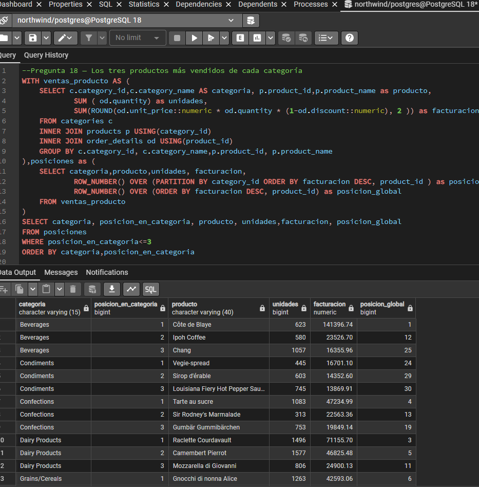

**Comentario:**

Usamos ROW_NUMBER y desempatamos por product_id para obtener tres productos por categoría. RANK y DENSE_RANK comparten posición en empates pero solo RANK deja saltos. Calculamos la posición global antes de filtrar para conservar la referencia a todos los productos vendidos.

## Pregunta 19. Evolución mensual con acumulado y media móvil

**Enunciado:**

Para cada mes de 1997 calcula facturación, acumulado desde enero, media móvil del mes actual y los dos anteriores, facturación del mes anterior y variación porcentual respecto a este.

**Consulta:**

```sql
-- Facturación mensual de 1997 con acumulado, media móvil y variación
-- Consulta preparada con ayuda de IA.
-- Enero no tiene anterior dentro del informe y muestra NULL en ambos campos.
WITH meses as (
	SELECT gs.mes::date as mes
	FROM generate_series(TIMESTAMP '1997-01-01', TIMESTAMP '1997-12-01',INTERVAL '1 month') as gs(mes)
),ventas_mes as (
	SELECT DATE_TRUNC('month',o.order_date )::date AS mes,
			SUM( ROUND(od.unit_price::numeric * od.quantity * ( 1-od.discount::numeric), 2)) as facturacion
	FROM orders o
	INNER JOIN order_details od USING(order_id)	
	WHERE o.order_date >= DATE '1997-01-01' and o.order_date < DATE '1998-01-01'	
	GROUP BY DATE_TRUNC('month', o.order_date)::date
),mensual AS (
	SELECT m.mes,COALESCE(v.facturacion, 0::numeric) AS facturacion
	FROM meses m
	LEFT JOIN ventas_mes v USING(mes)	
), ventanas AS (
	SELECT mes,facturacion,
			SUM(facturacion) OVER (ORDER BY mes ROWS BETWEEN UNBOUNDED PRECEDING AND CURRENT ROW) AS acumulado,
			AVG (facturacion) OVER ( ORDER BY mes ROWS BETWEEN 2 PRECEDING AND CURRENT ROW) AS media_movil_3m,
			LAG( facturacion) OVER (ORDER BY mes) as mes_anterior
	FROM mensual
)
SELECT mes, facturacion,acumulado,ROUND (media_movil_3m,2) AS media_movil_3m,mes_anterior,
			ROUND(100::numeric * ( facturacion - mes_anterior) / NULLIF(mes_anterior, 0), 2) AS variacion_pct
FROM ventanas
ORDER BY mes
```

**Resultado:**

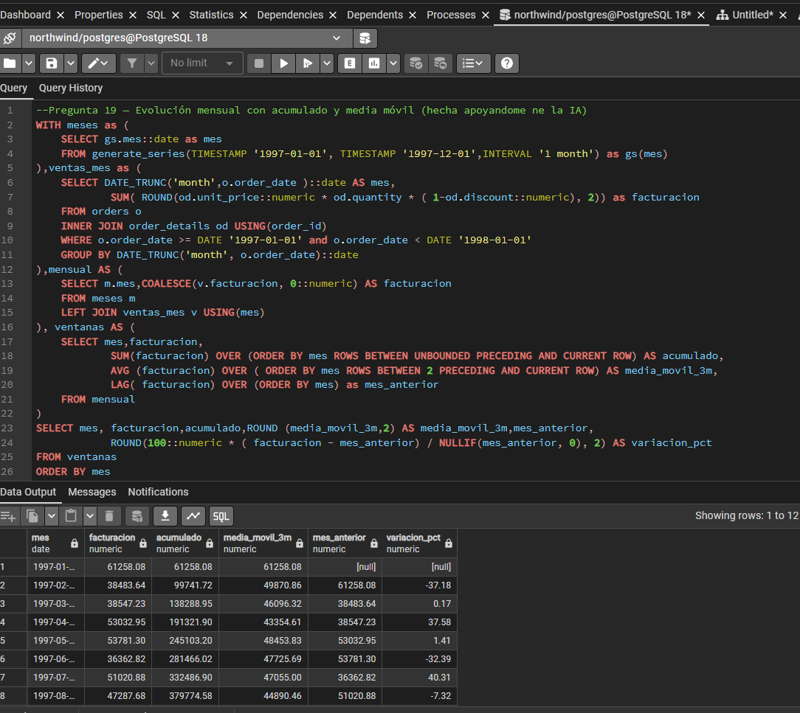

**Comentario:**

Completamos los doce meses para que la ventana avance por meses aunque falten ventas. La media usa hasta tres meses disponibles de 1997 y LAG obtiene el anterior. Dejamos NULL cuando no hay mes anterior o su facturación es 0 porque no podemos calcular ese porcentaje.

## Pregunta 20. Cuadro de mando anual por categoría

**Enunciado:**

Muestra por categoría la facturación de 1996, 1997 y 1998 en columnas separadas y el total. Añade al final los totales generales, el peso de cada categoría y la tendencia de 1997 a 1998. Usa FILTER y ROLLUP e indica dentro del SQL que los años incompletos impiden comparar la tendencia sin normalizar.

**Consulta:**

```sql
-- Facturación por categoría y año con total general, peso y tendencia
-- Consulta preparada con ayuda de IA.
-- 1996 empieza en julio y 1998 solo llega hasta mayo.
-- La tendencia compara importes brutos y no es comparable sin normalizar los periodos.
WITH lineas AS (
	SELECT p.category_id, EXTRACT(YEAR FROM o.order_date)::integer AS anio,
			ROUND(od.unit_price::numeric * od.quantity * (1-od.discount::numeric),2) AS importe
	FROM products p
	INNER JOIN order_details od USING(product_id)
	INNER JOIN orders o USING(order_id)
	WHERE o.order_date>=DATE '1996-01-01' AND o.order_date < DATE '1999-01-01'
),resumen AS (
	SELECT c.category_name,GROUPING(c.category_id) as es_total,
			COALESCE (sum(l.importe) FILTER (WHERE l.anio = 1996), 0::numeric) AS f_1996,
			COALESCE( sum( l.importe) FILTER (WHERE l.anio=1997),0::numeric ) AS f_1997,
			COALESCE(SUM(l.importe) FILTER (WHERE l.anio=1998), 0::numeric) as f_1998,
			COALESCE (SUM(l.importe), 0::numeric) AS total
	FROM categories c
	LEFT JOIN lineas l USING(category_id)
	GROUP BY ROLLUP (( c.category_id, c.category_name))
)
SELECT COALESCE( category_name, 'TOTAL GENERAL') as categoria,f_1996, f_1997, f_1998,total,
			ROUND(100::numeric * total / NULLIF (SUM(total) FILTER (WHERE es_total = 0) OVER (),0), 2) AS peso_pct,
			CASE WHEN f_1998 > f_1997 THEN 'CRECIÓ'
			WHEN f_1998 < f_1997 THEN 'DECRECIÓ'
			ELSE 'SIN CAMBIOS'
			END AS tendencia
FROM resumen
ORDER BY es_total,categoria
```

**Resultado:**

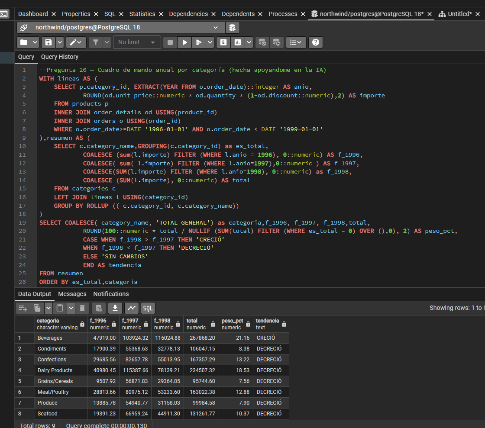

**Comentario:**

FILTER separa la facturación por año y ROLLUP añade el total general. Al calcular el porcentaje de cada categoría dejamos fuera la fila del total para no sumar la facturación dos veces. La tendencia usa importes sin normalizar y 1998 solo contiene datos hasta mayo.

[Volver a la portada](README.md).
